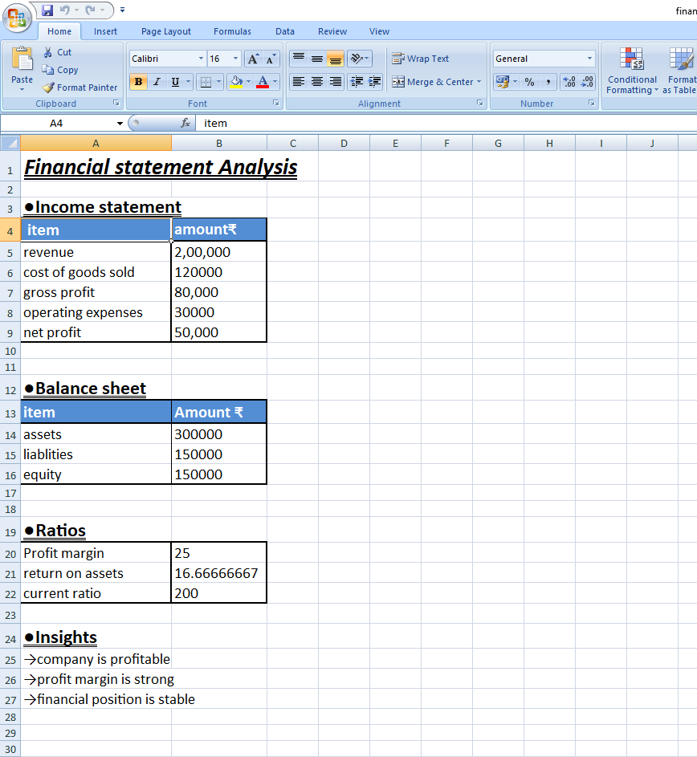

# 📈 Financial Statement Analysis

## 📌 Overview

This project is an Excel-based financial analysis model including an income statement, balance sheet, and key financial ratios.

## 🎯 Objective

To evaluate profitability and financial position using basic accounting concepts.

## ⚙️ Features

* Income Statement (Revenue, Expenses, Profit)
* Balance Sheet (Assets, Liabilities, Equity)
* Financial Ratios (Profit Margin, ROA, Current Ratio)
* Simple business insights

## 🛠️ Tools Used

* Microsoft Excel

  ## 📸 Dashboard Preview

## 📊 Output

* Profitability analysis
* Financial position evaluation
* Key ratio insights

## 👤 Author

**Bhuvan Sharma**
US CMA Candidate
